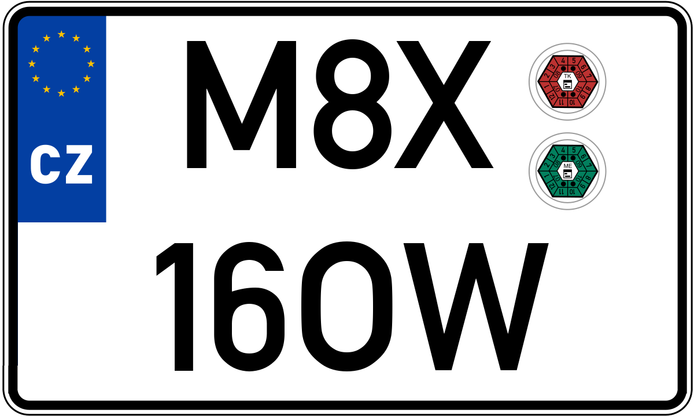

# License Plate Generator

## Setup

```
$ pip3 install Pillow
$ python3 licenseplate.py
```
Results in:




### Credits

This work is done by [Infotiv AB](https://www.infotiv.se) under [VALU3S](https://valu3s.eu) project. This project has received funding from the [ECSEL](https://www.ecsel.eu) Joint Undertaking (JU) under grant agreement No 876852. The JU receives support from the European Union’s Horizon 2020 research and innovation programme and Austria, Czech Republic, Germany, Ireland, Italy, Portugal, Spain, Sweden, Turkey.

[License Plate Generator](https://github.com/ebadi/LicensePlateGenerator) project is started and is currently maintained by [Hamid Ebadi](https://github.com/ebadi).

